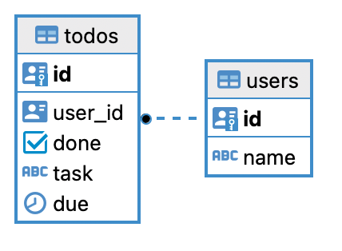
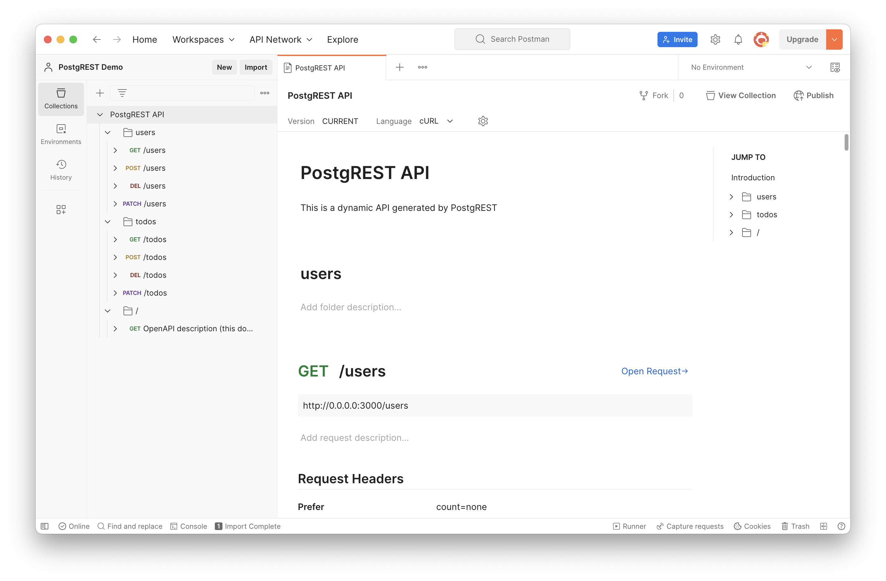

# PostgREST

> Serve a RESTful Api from any Postgres database

<!-- ---

# About Me

## Daniel Knibbe

<!--
Ich bin Softwareentwickler, RWTH Elektrotechnik Absolvent
und Radfahrer.

Ich habe die meiste Erfahrung im Bereich der C++ Backendentwicklung.
-->

---

# PostgREST

- Webserver welcher eine RESTful API für eine PostgreSQL Datenbank anbietet
- Deklarative Programmierung mittels SQL Schema
- Alle Endpunkte und Berechtigungen sind aus dem Datenbank Schema abgeleitet
- In Haskell geschrieben
- MIT Lizenz

---

# Motivation

- Datenmodell ein mal entwerfen
  - Single Source of Truth
- Es ist kein weiterer Code notwendig
  - Kein ORM, kein prozeduraler Code
  - Weniger Code, weniger Fehler
- Schnellere Entwicklung

---

# PostgreSQL

- Open Source Database
- Objektrelationale Datenbank
- Weitestgehend SQL konform
<!-- TODO: Was ist Postgres? -->

---

# REST

> Representational state transfer

- Software Paradigma, welches hauptsächlich für die Web-Entwicklung eingesetzt wird
- Ressourcen fokussiert
- Zustandslos
- Einheitliche Schnittstelle
  - URLs zur eindeutigen Adressierung von Ressourcen
  - Http Verben werden für die Abfrage und Manipulation der Ressourcen genutzt
- Lässt sich auf CRUD Operationen auf einer relationalen Datenbank abbilden

<!--
CRUD: Create, Read, Update, Delete
REST: POST, GET, PUT/PATCH/POST, DEL
SQL: INSERT, SELECT, UPDATE, DELETE
Here: PATCH implements an update
Here: PATCH implements an upsert for multiple rows
Here: PUT implements an upsert for a single row
-->

---

# Getting Started

<!--
Aufbau der Demo
- Wir erstellen ein einfaches Datenbank Schema (Todo App)
- Wir starten eine PostgreSQL Instanz als Docker Container
- Wir wenden das Schema mittels eines Migrationstools (Refinery) an
  - Das Migrationstools werden wir nicht weiter beachten
- Anschließend starten wir den PostgREST Server
-->

---

# Datenbank

<!--
Wir brauchend die Datenbank
-->

```yaml
version: "3.9"

services:
  db:
    image: postgres
    ports:
      - 5432:5432
    environment:
      - POSTGRES_PASSWORD=${DB_PASSWORD}
    healthcheck:
      test: ["CMD-SHELL", "pg_isready --username=postgres"]
      interval: 10s
      timeout: 5s
      retries: 5
…
```

---

# Schema



<!--
Das Schema ist bewusst einfach gehalten
-->

---

# Schema

<!-- TODO: Check if up to date with V__initial.sql -->

```SQL
create schema api;

create role web_anon nologin;
grant usage on schema api to web_anon;

…

create table api.users (
    id uuid primary key default uuid_generate_v4(),
    "name" name not null
);
grant select, update, insert, delete on table api.users to web_anon;

create table api.todos (
    id uuid primary key default uuid_generate_v4(),
    user_id uuid not null references api.users(id),
    done boolean not null default false,
    task text not null,
    due timestamptz
);
grant select, update, insert, delete on table api.todos to web_anon;
```

---

# Web Server

```yaml
…
rest:
  image: postgrest/postgrest
  ports:
    - 3000:3000
  environment:
    - PGRST_DB_URI=postgres://postgres:${DB_PASSWORD}@db:5432/postgres
    - PGRST_DB_SCHEMAS=api
    - PGRST_DB_ANON_ROLE=web_anon
…
  depends_on:
    db:
      condition: service_healthy
…
```

---

# Out of the Box

---

# Out of the Box



---

# Out of the Box

- Einen OpenAPI Schema Beschreibung über den Root Context Pfad
- Alle CRUD Methoden werden als REST Endpunkte zur Verfügung gestellt.
- Filter
- Pagination

## Missing

- Authentication/Authorization

<!--
Authentication: Ist der Nutzer wer er vorgibt zu sein?
  -> Keycloak
Authorization: Darf der Nutzer eine Ressource nutzen?
  -> User Id und JWT
User Id in Zeile wird nicht genutzt.
-->

---

# Adding the missing bits

<!--
- Schema update
- PostgREST config
- Keycloak server in Docker Compose
-->

---

# Schema Update

<!--
Relevant:
- PostgreSQL Feature: Row Level Security!
- User ID auf JWT extrahieren
- Default der user id auf die user id des JWT setzen
- Enable RLS and define policy
-->

```SQL
create schema auth;

create role app_user nologin;
grant usage on schema auth to app_user;
grant usage on schema api to app_user;

create function auth.current_user() returns uuid AS
$$
  begin
    return uuid(current_setting('request.jwt.claims', true)::json->>'sub');
  end;
$$ language 'plpgsql';

revoke select, update, insert, delete on table api.users from web_anon;
alter table api.users alter id set default auth.current_user();
alter table api.users enable row level security;
create policy access_policy on api.users using (
    id = auth.current_user ()
);
grant select, insert, update, delete on table api.users to app_user;
…
```

---

# PostgREST Config

<!--
Dazugekommen ist:
- PGRST_JWT_SECRET
- PGRST_JWT_ROLE_CLAIM_KEY Pfad im JWT zur Rolle des Nutzers. Wird auf Datenbank Rolle gemapped.
-->

```yaml
…
  rest:
    image: postgrest/postgrest
    ports:
      - 3000:3000
    environment:
      - PGRST_DB_URI=postgres://postgres:${DB_PASSWORD}@db:5432/postgres
      - PGRST_DB_SCHEMAS=api
      - PGRST_DB_ANON_ROLE=web_anon
      - PGRST_OPENAPI_MODE=ignore-privileges
      - PGRST_JWT_SECRET=${PGRST_JWT_SECRET}
      - PGRST_JWT_ROLE_CLAIM_KEY=.resource_access.app.roles[0]
      - PGRST_LOG_LEVEL=info
    depends_on:
      db:
        condition: service_healthy
…
```

---

# Weitere Infos

Doku: [https://postgrest.org/en/stable](https://postgrest.org/en/stable)
Github: [https://github.com/PostgREST/postgrest](https://github.com/PostgREST/postgrest)

---

# Vielen Dank

Die Folien und die Demo sind auf github.
https://github.com/dknibbe/postgrest-demo

<!-- TODO: Link/QR Code zum Repo -->
